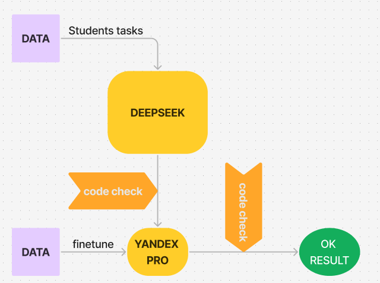

### Система работает следующим образом:

1 у нас есть локальный DeepSeek, который генерит более менее читаемые промты.
2 есть предобученный Yandex GPT PRO.

### Запуск:
> либо notebooks либо main
- Deepseek - "notebooks/deepseek.ipynb"
- YandexGPT - "notebooks/pipeline_yaGPT.ipynb" // самый актуальный код по датасету для дообучения модели и отправки 

### Фишки
> можно посмотреть "notebooks/pipeline_yaGPT.ipynb" там лонгрид по промтам, обучению, добавлению синтетики в трейн. 
> вся очиска происходит на входе, see 'jailbreak/clean_model_answer.ipynb' for additional information

### Верхеуровневно все выглядит так

- I. Берем решение студента(файл Solutions) и смотрим компилируется ли код или нет.
Если нет - отбрасываем все ошибки по оформлению и используем основную как сообщение часть промта для модели.
Можно попытаться сматчить ошибки и сообщения из файла.

- II. Используем сообщение об ошибке вместе с решением студента для промта GPT. Также используем стилистику из примеров для лучшего результата.

- III. Компилируем решение студента, на вход подаем данные из тестов и смотрим какой именно из тестов не прошел(не совпадает с output тестов).

У нас получается строка(Ошибка в открытых и скрытых тестах. )
Далее используя эту информацию составляем промт для GPT.
+ из решение автора составляем промт для gpt.

